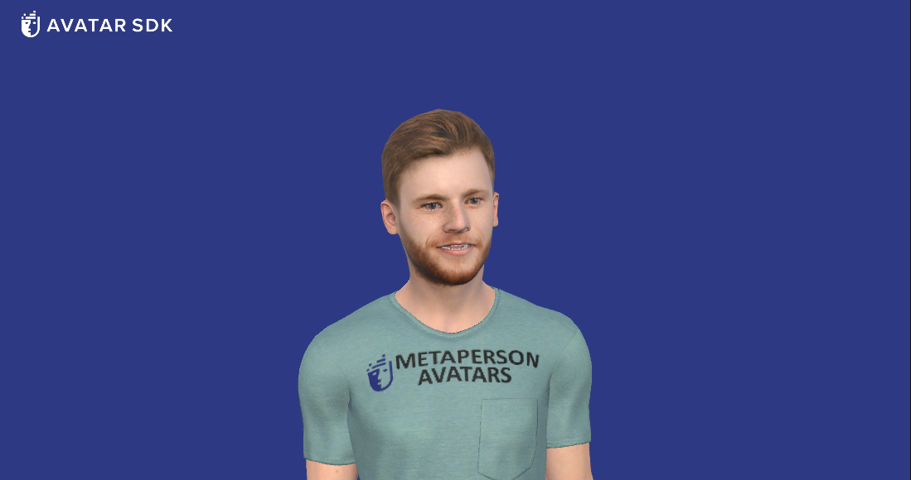
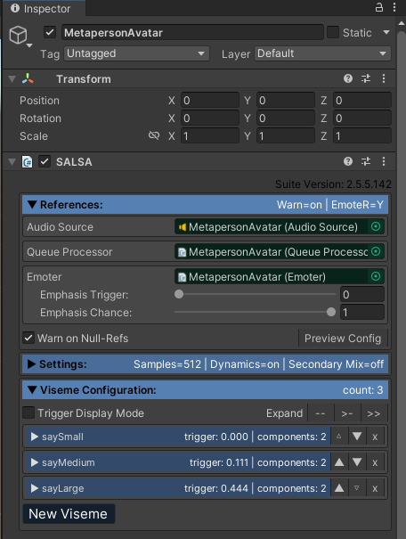

# MetaPerson - Unity SALSA LipSync Sample

This sample demonstrates how to use [MetaPerson](https://metaperson.avatarsdk.com/) avatars in Unity with [SALSA LipSync](https://crazyminnowstudio.com/docs/salsa-lip-sync/modules/overview/) package.



### Requirements
- Unity 2021.3.19f1 or newer
- [SALSA LipSync](https://assetstore.unity.com/packages/tools/animation/salsa-lipsync-suite-148442) package.

## Getting Started
1. Clone this repository to your computer
2. Open the project in Unity 2021.3.19f1 or newer.
3. Import the [SALSA LipSync Suite](https://assetstore.unity.com/packages/tools/animation/salsa-lipsync-suite-148442) package.
4. Open the scene MetapersonSalsaSampleScene located in Assets\AvatarSDK\MetaPerson\SalsaSample\Scenes
5. Run the demo project, click on the "Load another avatar" button to see how the avatar can be replaced in runtime.

## How does it work
There is the predefined avatar on the scene that is animated with SALSA when you run the project. When you click the button, another avatar is downloaded. Then it replaces the original one. Audio and facial animation keep playing continuously for the new avatar. The MetapersonAvatar object placed on the scene contains the predefined MetaPerson avatar and has a number of attached components. SALSA component is responsible for LipSync configuration, Audio Source and Queue Processor are responsible for playing and processing the audio. EmoteR component is optional and provides additional avatar emote settings. MetaPerson Loader handles the process of downloading and displaying a new avatar on the scene. MetaPerson Material Generator is required to provide configured materials for the Metaperson skeletal mesh.

## SALSA configuration
SALSA component contains a set of the most important LipSync parameters.



The first part contains general LipSync parameters, the second one includes configuration for visemes. Current configuration provides links to parts of the initial avatar skeletal mesh and ids of the visemes that are used to play animations. It also contains limits for blendshape values and threshold parameters that control which viseme should be triggered for input values. See the SALSA LipSync [official documentation](https://crazyminnowstudio.com/docs/salsa-lip-sync/modules/further-reading/expression-components/) for more detailed information about settings.

## Runtime configuration
When we change the avatar on the scene, the animation keeps playing without interruption. To achieve this, we provide SALSA component with references to the new mesh parts instead of the old ones, which are no longer valid as far as the previous avatar skeletal mesh is not on the scene. This is done in the OnButtonClick() method of the SalsaSampleSceneHandler class.

```cs
Dictionary<string, string> blendshapes = new Dictionary<string, string>() {
    {"saySmall","DD" },
    {"sayMedium","oh" },
    {"sayLarge","aa" },
};

foreach (var viseme in salsa.visemes)
{
    string blenshapeName = blendshapes[viseme.expData.name];
    if (viseme.expData.controllerVars.Count == 2)
    {
        viseme.expData.controllerVars[0].maxShape = 0.01f;
        viseme.expData.controllerVars[0].smr = meshes["AvatarHead"];
        viseme.expData.controllerVars[0].blendIndex = meshes["AvatarHead"].sharedMesh.GetBlendShapeIndex(blenshapeName);
        viseme.expData.controllerVars[1].maxShape = 0.01f;
        viseme.expData.controllerVars[1].smr = meshes["AvatarTeethLower"];
        viseme.expData.controllerVars[1].blendIndex = meshes["AvatarTeethLower"].sharedMesh.GetBlendShapeIndex(blenshapeName);
    }
}
```
Here we iterate through the list of all configured blendshapes and set corresponding mesh part references. We also set the blenshape indices. 

The same operation is performed for the EmoteR object:

```cs
foreach(var emote in salsa.emoter.emotes)
{
    for(int i = 0; i < emote.expData.controllerVars.Count; i++)
    {
        var controllerVar = emote.expData.controllerVars[i];
        controllerVar.smr = meshes["AvatarHead"];
        controllerVar.maxShape = 0.008f;
        controllerVar.blendIndex = meshes["AvatarHead"].sharedMesh.GetBlendShapeIndex(emote.expData.components[i].name);
    }
}
```

Please see the official API documentation for [ExpressionComponents](https://crazyminnowstudio.com/docs/salsa-lip-sync/modules/further-reading/expression-components/#api-examples-for-expressioncomponents) and [EmoteR](https://crazyminnowstudio.com/docs/salsa-lip-sync/modules/emoter/api/) for more details.