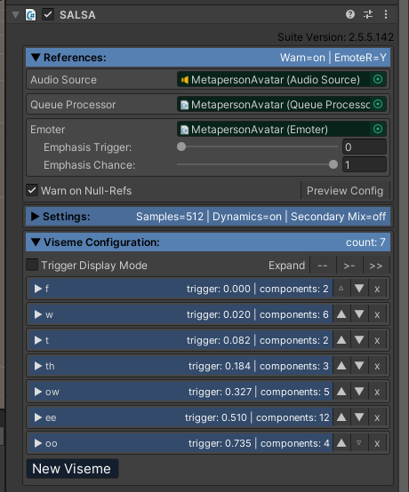

# MetaPerson - Unity SALSA LipSync Sample

This sample demonstrates how to use [MetaPerson](https://metaperson.avatarsdk.com/) avatars in Unity with [SALSA LipSync](https://crazyminnowstudio.com/docs/salsa-lip-sync/modules/overview/) package.


### Requirements
- Unity 2021.3.19f1 or newer
- [SALSA LipSync](https://assetstore.unity.com/packages/tools/animation/salsa-lipsync-suite-148442) package.
- [OneClick Base](https://crazyminnowstudio.com/unity-3d/lip-sync-salsa/downloads/) package.

## Getting Started
1. Clone this repository to your computer
2. Open the project in Unity 2021.3.19f1 or newer.
3. Import the [SALSA LipSync Suite](https://assetstore.unity.com/packages/tools/animation/salsa-lipsync-suite-148442) package.
4. Import the [OneClick Base](https://crazyminnowstudio.com/docs/salsa-lip-sync/addons/one-clicks/). See additional [documentation](https://crazyminnowstudio.com/docs/salsa-lip-sync/addons/one-clicks/) on OneClicks.
5. Open the `Assets/AvatarSDK/MetaPerson/SalsaSample/Scenes/MetapersonSalsaSampleScene.unity` scene.
6. Run the scene. LipSync should start for the predefined avatar on the scene.
7. Click on the "Load another avatar" button to see how the avatar can be replaced at runtime.

## How does it work
There is the predefined avatar on the scene that is animated with SALSA when you run the project. This avatar was imported from an FBX file and its facial animation was configured with help of the OneClick add-on. When you run the application and click the button, another avatar is downloaded. Then it replaces the original one. Audio and facial animation keep playing continuously for the new avatar. The MetapersonAvatar object placed on the scene contains the predefined MetaPerson avatar and has a number of attached components. SALSA component is responsible for LipSync configuration, Audio Source and Queue Processor are responsible for playing and processing the audio. EmoteR component is optional and provides additional avatar emote settings. MetaPerson Loader handles the process of downloading and displaying a new avatar on the scene. MetaPerson Material Generator is required to provide configured materials for the Metaperson skeletal mesh.

## SALSA configuration
SALSA component contains a set of the most important LipSync parameters.



The first part contains general LipSync parameters, the second one includes configuration for visemes. Current configuration provides links to parts of the initial avatar skeletal mesh and ids of the visemes that are used to play animations. It also contains limits for blendshape values and threshold parameters that control which viseme should be triggered for input values. See the SALSA LipSync [official documentation](https://crazyminnowstudio.com/docs/salsa-lip-sync/modules/further-reading/expression-components/) for more detailed information about settings.
Two more components with self-descriptive names attached to the game object are [EmoteR](https://crazyminnowstudio.com/docs/salsa-lip-sync/modules/emoter/overview/) and [Eyes](https://crazyminnowstudio.com/docs/salsa-lip-sync/modules/eyes/overview/). Both provide configuration options for corresponding animations and are created automatically by OneClick.

## OneClick configuration
OneClicks is the equivalent of preset for MetaPerson avatars. With OneClick you can easily configure lipsync animation for your metaperson avatar, imported from FBX. To use OneClick, select the avatar game object.


Now click the GameObject->Crazy Minnow Studio->One-clicks->Avatar SDK menu item. Your Avatar will be automatically configured for SALSA lipsync.


## Runtime configuration
When we change the avatar on the scene, the animation keeps playing without interruption. To achieve this, in SalsaSampleSceneHandler script we clear all the configurations:

```cs
ReleaseSalsa();
ReleaseSalsaEyes();   
```

after that we replace avatar on the scene:
```cs
MetaPersonUtils.ReplaceAvatar(loader.avatarObject, existingAvatar);
```

and then configure everything for new model with help of the OneClick classes:
```cs
OneClickAvatarSdk.Setup(dstObject);        
OneClickAvatarSdkEyes.Setup(dstObject);
```

Please see the official API documentation for [ExpressionComponents](https://crazyminnowstudio.com/docs/salsa-lip-sync/modules/further-reading/expression-components/#api-examples-for-expressioncomponents) and [EmoteR](https://crazyminnowstudio.com/docs/salsa-lip-sync/modules/emoter/api/) for more details.

## Support

If you have any questions or issues with this project, please contact us at <support@avatarsdk.com>.
